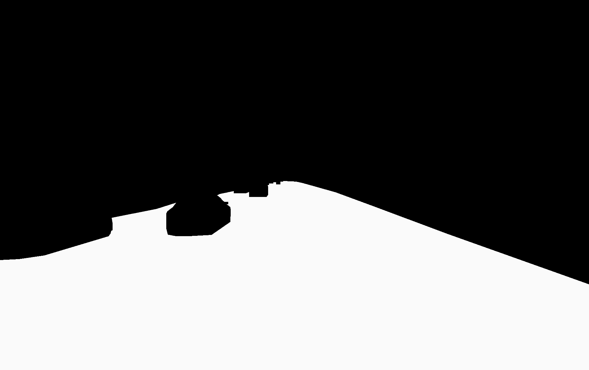

# Intern_Project
## FREESPACE SEGMENTATION WITH FULLY CONVOLUTIONAL NEURAL NETWORKS

1. (Optional) It is suggested to use virtual environment, in the root directory:

    * create a virtual environment: 
    
          python3 -m venv venv
    * activate the virtual environment: 
    
          source venv/bin/activate

    * deactivate the virtual environment: 
    
          deactivate

    - YOU HAVE TO BE IN THE ROOT DIRECTORY FOR THIS COMMANDS. 

2. Install required libraries:

        pip install -r requirements.txt

3. Run the code (for fun)

    In order to run a code, you have to go to src directory, firstly.

        cd src/
        python3 ex_json2mask.py
4. Result:
      
      
